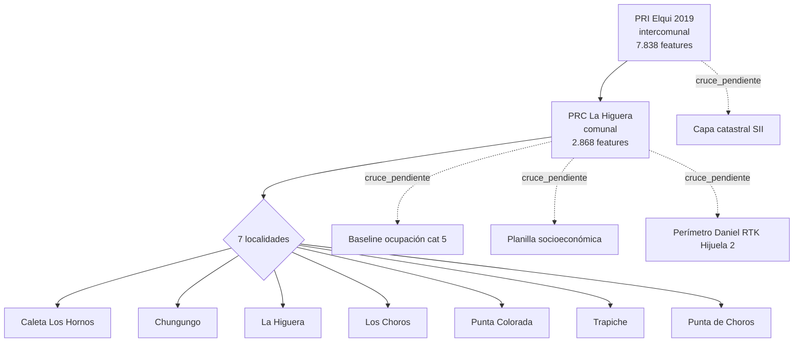

# Ingesta normativa territorial · PRI Elqui 2019 + PRC La Higuera · ITS v1

**Disparador:** instrucción canónica · construir capa 5 normativa (Magnus Radar / ITS)
**Disciplina aplicada:** hecho_observado / inferencia / hipótesis · NO inferir usos no contenidos
**Fecha:** 2026-05-31

---

## Resumen ejecutivo (10 hallazgos)

1. **PRI Elqui 2019** (intercomunal · 25 MB) contiene **7.838 elementos normativos** distribuidos en 12 categorías. Cobertura intercomunal Provincia de Elqui.

2. **PRC La Higuera** (comunal · 2.2 MB) contiene **2.868 elementos normativos** distribuidos en **7 localidades**: Caleta Los Hornos, Chungungo, La Higuera, Los Choros, Punta Colorada, Trapiche, Punta de Choros.

3. **Dominante del PRI Elqui**: 6.898 polígonos de **riesgo de remoción en masa** "Alta" cubriendo **249.229 ha** intercomunales.

4. **216 zonas de extensión urbana** del PRI cubren **991.899 ha** con códigos AR-3, ZEU-4, ZEU-6, AV.

5. **Riesgo de maremoto/tsunami**: 17 polígonos área inundable (urbana + rural) + 197 líneas de cota maremoto (722 km lineales) en categorías Muy Alta / Alta / Moderada · clasificadas además por contexto (Urbana / Rural / Isla).

6. **El asentamiento cat 5 detectado** en la ortofoto de Hijuela 2 cae sobre **438 elementos normativos del PRC + PRI** que se superponen al bbox · incluye zonas urbanas, áreas de restricción AR1/AR2/AR3 e inmuebles de conservación histórica (12 ICH en Q10).

7. **Códigos de zonificación PRC La Higuera detectados:** ZU1 (133), ZU2 (43), ZU3 (9), ZU4 (40), ZU5 (5), ZAV (145), ZIS (11), ZAP (6), ZE (32), ZC (3), ZIP (6), ZIT (3), AR1 (24), AR3 (1), ICH, ZCH1, ZCH2. **Sus significados están en HIPÓTESIS** · requieren validación contra texto del PRC.

8. **PRI Elqui declara expresamente** 6 minas relevantes en el corredor: Mina El Romeral, Mina El Brillador, Mina El Tofo, Mineras Andacollo + Tranque Relaves El Romeral. Adicionalmente **ZOIT Valle del Elqui** (16.068 ha) + Santuario Naturaleza (56 ha).

9. **Vialidad estructurante consolidada**: 397 km intercomunal (PRI) + 144 km comunal (PRC) + 628 km líneas transmisión eléctrica (PRI). Las 7 localidades del PRC tienen su propia red vial planificada con códigos por localidad.

10. **El asentamiento sobre Q10/Q11/Q20/Q21 NO está geográficamente en zona incompatible** según el catastro normativo: las zonas urbanas y de extensión urbana existen sobre esos cuadrantes. Las restricciones AR1/AR2 son señales de cuidado, no de incompatibilidad absoluta. Esto matiza la afirmación del due diligence de que las tomas están "95% en suelo rural" · al menos parte del territorio tiene zonificación urbana planificada.

---

## FASE 1 · Inventario de los instrumentos

```yaml
PRI_Elqui_2019:
  archivo: pri_elqui_final_enero2019.kmz
  hash_md5: 7e9ecdefda6d1856083c3172780c28e6
  size_bytes: 25.745.452
  kml_descomprimido: 83.609.211 bytes
  estructura: 1 folder raíz "Plano Zonificacion Costera" + 12 sub-folders + 50 styles
  cobertura: intercomunal · Provincia de Elqui · Región Coquimbo
  total_placemarks: 7.838
  proyeccion_declarada: WGS84 EPSG:4326 (estándar KML)
  fecha_instrumento: enero 2019

PRC_La_Higuera:
  archivo: PRC_LA_HIGUERA.kmz
  hash_md5: 981b3cd2298cb27abb977ae62f18374f
  size_bytes: 2.231.304
  kml_descomprimido: 10.039.964 bytes
  estructura: 7 Documents (1 por localidad) + 45 folders
  total_placemarks: 2.868
  proyeccion_declarada: WGS84 EPSG:4326
  
  problema_detectado_y_resuelto:
    error_xml: prefijo "xsi:" y "padding:" usados pero no declarados
    impacto: parser estándar falla
    fix_aplicado: agregar declaraciones xmlns:xsi y xmlns:padding artificiales
    estado: parseado_exitosamente

  cobertura_por_localidad:
    - Caleta Los Hornos: 370 placemarks
    - Chungungo: 210 placemarks
    - La Higuera (pueblo cabecera comunal): 416 placemarks
    - Los Choros: 232 placemarks
    - Punta Colorada: 175 placemarks
    - Trapiche: 1.011 placemarks (mayoría infraestructura sanitaria)
    - Punta de Choros: 453 placemarks
```

---

## FASE 2 · Extracción de zonificación

### Zonificación PRI Elqui (nivel intercomunal)

| Tipo normativo | Cantidad | Superficie | Notas |
|---|---|---|---|
| Riesgo remoción en masa (categoría Alta) | 6.898 polígonos | **249.229 ha** | dominante absoluto |
| Zona extensión urbana (códigos AR-3, ZEU-4, ZEU-6, AV) | 216 polígonos | **991.899 ha** | superficie incluye áreas grandes intercomunales |
| Riesgo maremoto (polígonos) | 17 polígonos | 13.962 ha | clasificados urbano/rural |
| Riesgo inundación (categoría Muy Alta) | 111 polígonos | 29.118 ha | |
| Minas declaradas | 6 polígonos | 3.565 ha | El Romeral, El Brillador, El Tofo, Andacollo, Tranque Relaves El Romeral |
| ZOIT (Zona Interés Turístico) | 1 polígono | 16.068 ha | "Valle del Elqui" |
| Santuario de la Naturaleza | 1 polígono | 56 ha | |

### Zonificación PRC La Higuera (nivel comunal)

| Localidad | Polígonos zonificación | Superficie zonificada |
|---|---|---|
| Caleta Los Hornos | 91 | 73 ha |
| Chungungo | 86 | 107 ha |
| La Higuera | 42 | 101 ha |
| Los Choros | 51 | 104 ha |
| Punta Colorada | 58 | 63 ha |
| Trapiche | 43 | 36 ha |
| Punta de Choros | 77 | 154 ha |
| **TOTAL** | **448** | **638 ha** |

### Códigos de zona detectados (HIPÓTESIS · pendiente validar con texto PRC)

| Código | Frecuencia | Significado (HIPÓTESIS) |
|---|---|---|
| ZU1 | 133 | Zona Urbana 1 (típicamente residencial alta densidad) |
| ZAV | 145 | Zona Área Verde |
| ZU2 | 43 | Zona Urbana 2 (densidad media-baja) |
| ZU4 | 40 | Zona Urbana 4 (mixta o periurbana) |
| ZE | 32 | Zona Equipamiento |
| AR1 | 24 | Área Restricción 1 (riesgo natural alto) |
| AV | 16 | Área Verde |
| ZIS | 11 | Zona Infraestructura Sanitaria |
| ZU3 | 9 | Zona Urbana 3 (baja densidad) |
| ZIP | 6 | Zona Industrial Permitida |
| ZAP | 6 | Zona Actividades Productivas |
| ZU5 | 5 | Zona Urbana 5 |
| ZC | 3 | Zona Comercial |
| ZIT | 3 | Zona Industrial Turística |
| ZCH1, ZCH2 | 2 | Zonas Caleta Hornos (locales) |
| AR3 | 1 | Área Restricción 3 |

**DISCIPLINA APLICADA:** todos los significados son HIPÓTESIS · NO se infieren usos permitidos / prohibidos sin texto del PRC oficial. Anti-patrón prohibido: convertir "ZU1 = residencial alta densidad" en HECHO sin verificar el documento normativo.

---

## FASE 3 · Extracción de restricciones

| Tipo restricción | Fuente | Cantidad | Superficie |
|---|---|---|---|
| Riesgo remoción en masa (Alta) | PRI | 6.898 | 249.229 ha |
| Riesgo inundación (Muy Alta) | PRI | 111 | 29.118 ha |
| Maremoto (polígonos inundables) | PRI | 17 | 13.962 ha |
| Maremoto (líneas de cota) | PRI + PRC | 213 | 746 km lineales |
| AR2 (Restricción tipo 2) | PRC | 155 | 46 ha |
| AR1 (Restricción tipo 1) | PRC | 153 | 162 ha |
| AR3 (Restricción tipo 3) | PRC | 6 | 8 ha |
| ICH (Inmueble Conservación Histórica) | PRC | 13 | 0.1 ha (puntuales) |
| Santuario Naturaleza | PRI | 1 | 56 ha |
| Mina (zona minera) | PRI | 6 | 3.565 ha |

**INFERENCIA razonable (NO HECHO):** la convención típica chilena PRC asocia AR1/AR2/AR3 con tipos de restricción por riesgo natural · pero **la semántica exacta depende de cada PRC** y debe leerse en el texto del instrumento.

---

## FASE 4 · Usos del suelo (HIPÓTESIS · NO se han extraído del texto normativo)

**Aplicación estricta de la disciplina obligatoria:**

```yaml
usos_permitidos: PENDIENTE_LECTURA_TEXTO_PRC_y_PRI
usos_restringidos: PENDIENTE_LECTURA_TEXTO_PRC_y_PRI
usos_condicionados: PENDIENTE_LECTURA_TEXTO_PRC_y_PRI
usos_prohibidos: PENDIENTE_LECTURA_TEXTO_PRC_y_PRI

razon:
  "los KMZ contienen geometrías y códigos de zona PERO NO el texto normativo
   que asocia cada código con usos específicos · ese texto está en la
   Ordenanza del PRC y en la Memoria del PRI"

fuente_a_consultar:
  PRC_La_Higuera: Decreto 676 (marzo 2020) según due diligence integral
  PRI_Elqui: enero 2019 (fecha del KMZ)
  ya_disponible_en_data_room:
    - 03_TERRITORIAL_NORMATIVA/ANALISIS_PRI_ELQUI_LA_HIGUERA_2026.md
    - due_diligence_integral_2026 §4 (analiza zonas pero parcialmente)
```

---

## FASE 5 · Infraestructura planificada

| Tipo | Fuente | Cantidad | Longitud |
|---|---|---|---|
| Vialidad estructurante intercomunal | PRI | 172 | 397 km |
| Vialidad estructurante comunal | PRC (7 localidades) | 1.199 | 144 km |
| Líneas de transmisión eléctrica | PRI | 69 | 628 km |
| Límite extensión urbana | PRI | 140 | 776 km |
| Límite territorio plan | PRI | 10 | 493 km |
| Infraestructura sanitaria (Trapiche) | PRC | 871 | 1.6 km |

**Vialidad comunal por localidad:**

| Localidad | Líneas vialidad | km lineales |
|---|---|---|
| Punta de Choros | 282 | 36.2 |
| La Higuera | 236 | 26.3 |
| Caleta Los Hornos | 230 | 18.8 |
| Los Choros | 166 | 20.8 |
| Punta Colorada | 115 | 13.5 |
| Trapiche | 89 | 10.2 |
| Chungungo | 81 | 18.3 |

---

## FASE 6 · IDs persistentes generados (preparación cruces ITS)

```yaml
schema_id_normativo:
  formato: "NORM-{fuente}-{tipo_normativo}-{localidad}-{n}"
  ejemplos:
    - NORM-PRI-riesgo_remocion_masa-intercomunal_elqui-00001
    - NORM-PRC-zona_urbana-la_higuera-00042
    - NORM-PRC-restriccion_AR2-la_higuera-00107

total_features_con_id_persistente:
  PRI_Elqui: 7.838
  PRC_La_Higuera: 2.868
  
exportaciones_listas_para_cruce:
  - normativo_pri_elqui.geojson (7.838 features con id)
  - normativo_prc_la_higuera.geojson (2.868 features con id)
  - tbl_zonas_normativas.csv
  - tbl_restricciones.csv
  - tbl_infraestructura_planificada.csv

campos_disponibles_por_feature:
  - id_normativo (PK)
  - fuente (PRI_ELQUI_2019 | PRC_LA_HIGUERA)
  - tipo_normativo
  - localidad
  - codigo_zona (cuando extraíble)
  - geom_type (Polygon / LineString)
  - area_ha o length_m
  - bbox
  - folder_path (trazabilidad al instrumento)
  - requiere_validacion_normativa_humana: true
```

---

## FASE 7 · Conflictos potenciales (HIPÓTESIS · NO conclusiones jurídicas)

### Cruce con baseline ocupación cat 5 (4 cuadrantes Q10/Q11/Q20/Q21)

```yaml
bbox_ortofoto: (-71.2153, -29.5232, -71.1835, -29.5031)

normativa_que_toca_la_zona_ocupada: 438 elementos
  
desglose_por_tipo:
  vialidad_estructurante:                    236
  restriccion_AR2:                           107 · 21.8 ha
  zona_urbana:                                42 · 100.9 ha
  restriccion_AR1:                            13 · 27.0 ha
  inmueble_conservacion_historica:            12 · concentrados en Q10
  zona_extension_urbana:                       8 · 377.001 ha
  riesgo_inundacion:                           6 · 7.154 ha
  restriccion_AR3:                             5 · 7.9 ha
  linea_transmision:                           3
  limite_extension_urbana:                     2
  vialidad_estructurante_intercomunal:         2
  limite_urbano:                               1 · 195.9 ha
  riesgo_remocion_masa:                        1 · 6.281 ha
```

### Por cuadrante de ocupación detectada

```yaml
Q10 (cat 5):
  vialidad: 32 · AR2: 19 · ICH: 11 · zonas urbanas: 8 · AR1: 5
  inundación: 4 · zona extensión urbana: 6 · límite urbano: 1
  
  HIPÓTESIS_destacada: Q10 tiene 11 inmuebles de conservación histórica
                        + 19 AR2 + 5 AR1 · zona con muchas restricciones
                        Y SIMULTÁNEAMENTE 8 zonas urbanas formales

Q11 (cat 5):
  vialidad: 38 · zonas urbanas: 15 · zona extensión urbana: 6
  AR3: 4 · AR1: 4 · inundación: 4 · AR2: 3
  
  HIPÓTESIS_destacada: Q11 tiene la mayor cantidad de zonas urbanas formales (15)
                        · zona presumiblemente más consolidada urbanísticamente

Q20 (cat 5):
  vialidad: 47 · AR2: 14 · zonas urbanas: 11 · AR1: 5
  inundación: 4 · zona extensión urbana: 6

Q21 (cat 5):
  vialidad: 42 · zonas urbanas: 9 · zona extensión urbana: 6
  AR2: 4 · inundación: 4 · AR1: 1
```

### Posibles conflictos territoriales (HIPÓTESIS)

```yaml
HIPOTESIS_1_asentamiento_NO_es_incompatible_con_PRC:
  enunciado: las 4 cuadrantes cat 5 SÍ tienen zonas urbanas formales + extensión urbana
  evidencia: 42 polígonos zona_urbana + 24 polígonos zona_extension_urbana en el bbox
  implicacion: contradice parcialmente la afirmacion "95% en suelo rural" del due diligence
  estatus: NO_DEMOSTRADA · requiere lectura del texto del PRC y cruce geométrico fino

HIPOTESIS_2_AR1_y_AR2_son_riesgos_naturales:
  enunciado: AR1 podría ser "alto riesgo" y AR2 "medio riesgo" (convención típica chilena)
  evidencia: convención de muchos PRCs chilenos
  estatus: HIPÓTESIS · requiere texto del PRC La Higuera (Decreto 676/2020)

HIPOTESIS_3_ICH_concentrados_en_Q10_relevantes_para_saneamiento:
  enunciado: 11 inmuebles de conservación histórica en Q10 pueden complicar saneamiento
  evidencia: 12 ICH del PRC en bbox · 11 caen en Q10
  estatus: HIPÓTESIS · requiere validar ubicación exacta + identidad de cada ICH

HIPOTESIS_4_riesgo_inundacion_presente_en_4_cuadrantes:
  enunciado: la zona del asentamiento está bajo riesgo de inundación
  evidencia: 4 polígonos riesgo_inundacion "Muy Alta" en cada cuadrante cat 5
  estatus: HIPÓTESIS · requiere ver cobertura espacial fina + cota del terreno
  observacion: el due diligence ya menciona 36.4 ha de inundación alta en el pueblo

HIPOTESIS_5_zona_extension_urbana_grande_irrelevante:
  enunciado: las 377.001 ha de zona extensión urbana en el bbox NO indican que toda
              esa superficie esté en el bbox · son polígonos que cruzan el bbox
              pero pueden ser mucho más grandes que el bbox
  estatus: HIPÓTESIS · revisar areas individuales
```

**NINGUNA HIPÓTESIS se ha promovido a HECHO. NO se emite conclusión jurídica.**

---

## FASE 8 · Exportación Magnus Radar

```yaml
entregables_generados:
  
  raw_data:
    - raw_pri_elqui.json
    - raw_prc_la_higuera.json
  
  normalizado_con_ids:
    - normalized_pri_elqui.json (7.838 features)
    - normalized_prc_la_higuera.json (2.868 features)
  
  geojson_para_visor:
    - normativo_pri_elqui.geojson
    - normativo_prc_la_higuera.geojson
  
  tablas_csv:
    - tbl_zonas_normativas.csv
    - tbl_restricciones.csv
    - tbl_infraestructura_planificada.csv
  
  diccionario_provisorio:
    - diccionario_codigos_zona_HIPOTESIS.json (todos HIPÓTESIS · pendiente PRC)
```

### Grafo normativo preliminar



---

## Backlog de integración ITS

```yaml
prioridad_1_completar_diccionario_codigos:
  fuente_canonica_necesaria: Ordenanza PRC La Higuera (Decreto 676/2020)
  ya_disponible_en_data_room: 03_TERRITORIAL_NORMATIVA/ANALISIS_PRI_ELQUI_LA_HIGUERA_2026.md
  accion: leer documento + transcribir tabla codigo→uso permitido/restringido/prohibido
  estado_actual: 17 códigos en HIPÓTESIS · 0 en HECHO

prioridad_2_cruce_geometrico_fino:
  metodo_actual: solo bbox overlap (preliminar)
  metodo_pendiente: intersección polígono-polígono real con shapely
  utilidad: confirmar qué % de cada cuadrante cae en cada zona normativa
  esfuerzo: medio

prioridad_3_integrar_a_Magnus_Radar_segun_canon_v2:
  estructura_propuesta_segun_ONTOLOGIA_v2:
    objeto_territorial: tipo=zona_normativa | restriccion | infraestructura_planificada
    capa: SII / CBR / Daniel_RTK / NORMATIVA (nueva)
  
  reglas_aplicadas:
    - PRINCIPIO_2_fuente_unica (cada feature tiene 1 fuente declarada)
    - rol_sii_no_es_identidad (las zonas normativas NO se identifican por rol SII)
    - doctrina_homonimia_territorial (códigos como ZU1 pueden tener significado distinto en otros PRCs · NO copiar)

prioridad_4_cruzar_con_planilla_socioeconomica:
  preguntas_que_resuelve:
    - cuántas viviendas están en zona ZU1 vs ZU2 vs ZAV?
    - cuántas en áreas de restricción AR1/AR2?
    - cuántas en zona urbana formal vs extensión urbana vs rural?
  
prioridad_5_cruzar_con_catastro_SII:
  preguntas_que_resuelve:
    - el rol 24-123 cae en qué zonas del PRC?
    - los 0-0 del catastro coinciden con áreas de restricción?
    - hay zonas urbanas en suelo del rol 24-5 (Andes Iron)?

prioridad_6_cruzar_con_perimetro_Daniel_RTK:
  preguntas_que_resuelve:
    - el perímetro RTK de Hijuela 2 atraviesa cuántas zonas del PRC?
    - el corredor está homogéneo o fragmentado normativamente?

futuro_PRI_Elqui_2024:
  nota: el PRI subido es de 2019
  posible_actualizacion: existe PRI Elqui actualizado?
  accion: validar fecha vigencia con MINVU SEREMI
```

---

## Disciplina aplicada · control de calidad

```yaml
hecho_observado:
  - cantidad_de_placemarks_extraidos: 10.706 totales (7.838 + 2.868)
  - tipos_normativos_clasificados: 21 distintos
  - 7_localidades_PRC_identificadas
  - 6_minas_PRI_declaradas_por_nombre
  - codigo_de_zona_extraido_en_27_pct_de_placemarks_PRC_directamente_del_campo_name
  - geometria_y_bbox_extraidos_para_100_pct_de_placemarks_con_coords

inferencia:
  - tipo_normativo_asignado_por_path_del_folder (mecanico · no semantico)
  - localidad_asignada_por_sufijo_codigo (mecanico)
  - asentamiento_cat_5_intersecta_normativa (bbox overlap)

hipotesis:
  - significado_de_cada_codigo_de_zona (17 códigos · todos en HIPÓTESIS)
  - clasificacion_AR1/AR2/AR3_como_riesgos_naturales_de_intensidad_decreciente
  - usos_permitidos / restringidos / prohibidos (PENDIENTE_TEXTO_NORMATIVO)
  - 5_hipotesis_sobre_conflictos_territoriales (todas marcadas HIPÓTESIS)

ninguna_conclusion_juridica_emitida: ✓
ninguna_inferencia_promovida_a_hecho: ✓
diccionario_codigos_marcado_como_HIPOTESIS: ✓
campos_pendientes_marcados_como_PENDIENTE: ✓
```

---

## Anexos generados

| Archivo | Tipo | Tamaño aprox |
|---|---|---|
| `INGESTA_NORMATIVA_PRI_PRC_ITS_v1.md` | este reporte | — |
| `normativo_pri_elqui.geojson` | 7.838 features | ~3 MB |
| `normativo_prc_la_higuera.geojson` | 2.868 features | ~1 MB |
| `tbl_zonas_normativas.csv` | zonas con código | ~80 KB |
| `tbl_restricciones.csv` | restricciones | ~150 KB |
| `tbl_infraestructura_planificada.csv` | vialidad + transmisión | ~70 KB |
| `diccionario_codigos_zona_HIPOTESIS.json` | 17 códigos · TODOS HIPÓTESIS | ~3 KB |
| `raw_pri_elqui.json` | raw post-parsing | ~5 MB |
| `raw_prc_la_higuera.json` | raw post-parsing | ~2 MB |
| `normalized_pri_elqui.json` | con tipos asignados | ~5 MB |
| `normalized_prc_la_higuera.json` | con tipos + localidades | ~2 MB |
