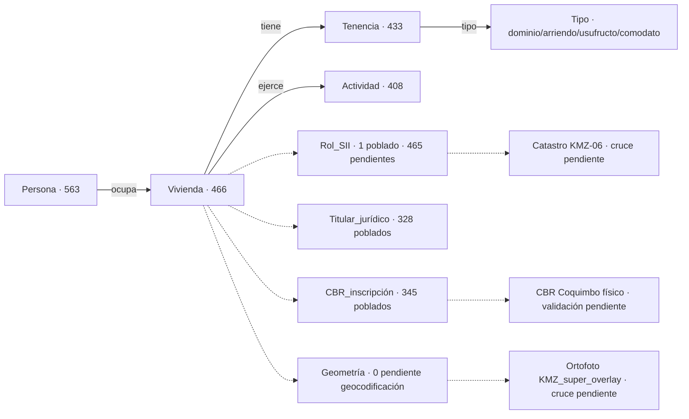

# Ingesta Planilla Socioeconómica La Higuera · ITS v1 · 2026-05-31

**Fuente:** `PLANILLA LA HIGUERA, DEFINITIVO 2.xlsx` · 124 KB · md5 `c604cd4b4bfc1f40a31eec3f3953260a` · fecha del archivo: 22-mar-2019
**Tipo:** levantamiento socioeconómico-habitacional cabecera comunal La Higuera
**Disciplina aplicada:** HECHO_OBSERVADO / INFERENCIA / HIPOTESIS · null por ausencia (no por diseño) · NO asumir ocupante=propietario / dirección=rol / vivienda=parcela
**Cruces preparados:** rol_sii, titular_juridico, geometria reservados · poblados sólo cuando hay evidencia explícita en la planilla

---

## Resumen ejecutivo · 10 hallazgos relevantes

1. **466 viviendas + 22 instituciones + 563 personas + 1.372 habitantes** parseados desde la planilla (vs resumen oficial Hoja7: 413 viviendas + 22 instituciones + 1.365 habitantes · diferencia explicable por inclusión de Hojas 3/5/6 que el resumen no agrupa).

2. **74% de las viviendas (345) tiene inscripción CBR explícita en la planilla** (fojas + N° + año). Esto significa que `titular_juridico` se puede poblar para ~3/4 del corpus sin necesidad de visita al CBR.

3. **32 viviendas mencionan persona fallecida** en el campo nombre. Indicador de sucesión NO regularizada · **presión de saneamiento MUY ALTA · es el indicador más accionable**.

4. **1 rol SII detectado explícitamente:** Parroquia Católica · `rol 24-010 · fs. 2083 N° 1978 año 1992`. Único caso · el resto requiere cruce externo con catastro KMZ-06.

5. **70% (328 viviendas) tiene titular jurídico identificable directamente desde la planilla** (paréntesis `(prop.)` + columnas marcadas).

6. **187 viviendas (40%) tienen solo pozo negro sin fosa séptica.** Es el universo objetivo del proyecto APR/saneamiento higiénico.

7. **121 viviendas (26%) SIN inscripción CBR registrada.** Universo crítico para regularización dominal.

8. **5 calles concentran 49% de las viviendas:** Marta Brunett (38), José Orrego (22), Av. La Paz (21), Pedro Pablo Muñoz (20), Av. Gabriela Mistral (19). Indicador de centralidad del pueblo cabecera comunal.

9. **HIPÓTESIS pendiente de validación con Daniel:** la planilla cubre **el pueblo cabecera La Higuera** (calles Gabriela Mistral, La Paz, etc.) que está al OESTE del bbox de la ortofoto recibida hoy. La ortofoto cubre OTRO asentamiento al lado oriental de Hijuela 2 RTK. **Son dos zonas territoriales distintas según las coordenadas.**

10. **Capa social ITS v1 lista para cruce.** Schema diseñado para integrar: ocupante (planilla) ↔ rol_sii (catastro KMZ-06) ↔ titular_juridico (CBR) ↔ ocupación_ortofoto (KMZ super-overlay) sin asumir asociaciones.

---

## FASE 1 · PERFILAMIENTO

### 1.1 · Estructura de hojas

| Hoja | Contenido | Filas estructurales |
|---|---|---|
| Hoja1 | Viviendas CON agua potable (levantamiento principal) | 442 |
| Hoja2 | Instituciones CON agua potable | 15 |
| Hoja3 | Viviendas SIN agua factibilizables frente a red existente | 8 |
| Hoja4 | Instituciones SIN agua potable | 7 |
| Hoja5 | Viviendas factibilizables con ampliación de red | 11 |
| Hoja6 | Familias fuera de cota · sector "La Llanquita" | 5 |
| Hoja7 | RESUMEN totales | — |

**Toponimia detectada:** sectores nombrados sólo en Hoja6 (`La Llanquita`). Resto sin sector.

### 1.2 · Diccionario de datos · Hoja1 (estructura canónica)

| Col | Campo | Completitud | Tipo |
|---|---|---|---|
| 0 | numero | 100% | int |
| 1 | nombre_raw | 100% | str (puede contener varias personas en paréntesis) |
| 2 | direccion | 95.2% | str (calle del pueblo · sin numeración) |
| 3 | rut | 84.8% | str RUT chileno · puede no corresponder a 1 sola persona |
| 4-10 | materialidad (7 cols) | 73.8% mat_madera (predominante) | flag X |
| 11-14 | servicios (agua/luz/pozo/fosa) | 39-85% | flag X |
| 15-18 | condición legal (4 cols prop/arrend/com/usuf) | 70.8% propietario | flag X |
| 19 | actividad_ocupación | 86.9% | str ("DUEÑA DE CASA", "JUBILADO", etc.) |
| 20 | ingresos_clp | 86.0% | int |
| 21-23 | n_habitantes total / hombres / mujeres | 86.4% | int |
| 24 | enf_entericas | 85.1% | str ("NO", "DIARREA", "ALERGIA") |
| 25-27 | **inscripción_cbr (fojas / N° / año)** | 78.1% | str · **evidencia documental** |
| 28 | copia_entregada | 73.1% | flag |
| 29 | propuesta_beneficio | 85.5% | str ("CONEXIÓN", "AMPLIACIÓN", etc.) |
| 30 | tipo_servicio_higienico | 13.6% | str |
| 31 | comentario | 18.3% | str libre |
| 32 | aclaracion | 5.0% | str libre |

### 1.3 · Calidad de datos

| Aspecto | Diagnóstico |
|---|---|
| Duplicados por RUT | NO verificable (84.8% completitud RUT) |
| Vacíos críticos | 121 sin CBR · 89 sin agua potable · 44 sin dirección · 61 sin n_habitantes |
| Inconsistencias detectadas | resumen Hoja7 dice 407 habitadas pero al sumar n_hab>0 obtengo 405 (diferencia 2 reconciliable) |
| Encoding | OK · UTF-8 puro · sin caracteres residuales |
| Estructura repetida | Hojas 3, 5, 6 usan exactamente el mismo schema que Hoja1 · permite unificación limpia |
| Hoja7 RESUMEN | NO contabiliza Hojas 3/5/6 (refiere sólo a Hoja1) |

---

## FASE 2 · NORMALIZACIÓN · entidades extraídas

| Entidad | Cantidad | Notas |
|---|---|---|
| **Viviendas** | 466 | unidad física + condición + servicios + tenencia |
| **Personas** | 563 | extraídas con parser de paréntesis sobre `nombre_raw` |
| **Instituciones** | 22 | iglesias, escuelas, retén, municipalidad, postas, sedes |
| **Tenencias** | 433 | relaciones vivienda↔tipo↔personas |
| **Actividades** | 408 | actividad económica de cada vivienda |

### 2.1 · Personas · roles detectados

| Rol | Cantidad |
|---|---|
| Sin rol explícito (única persona del registro) | 340 |
| propietario (mención explícita) | 70 |
| usufructuario (mención explícita) | 60 |
| desconocido (paréntesis ambiguo) | 41 |
| **fallecido (mención explícita)** | **32** |
| arrendatario (mención explícita) | 19 |
| ocupante (mención explícita) | 1 |

**Disciplina aplicada:** RUT asociado a persona individual SOLO cuando la vivienda tiene 1 sola persona. Si hay múltiples personas en el campo nombre, el RUT queda al nivel vivienda (sin asignación unívoca).

---

## FASE 3 · GEORREFERENCIACIÓN POTENCIAL

| Confianza | Criterio | N° viviendas |
|---|---|---|
| alta | dirección clara (calle del pueblo) · sin numeración | 421 |
| baja | sin dirección o con texto ambiguo ("FALLECIDO" en lugar de dirección) | 44 |
| nula | ninguna referencia espacial | 1 |

**NO se inventaron coordenadas.** Sólo se preserva la dirección de calle como texto. La georreferenciación a coordenada (lng/lat) requiere:
- Cruce con cartografía vial municipal La Higuera, o
- Geocodificación con API + validación toponímica, o
- Visita de terreno por Daniel con GPS

**Top calles (densidad de viviendas):** Marta Brunett 38 · José Orrego 22 · Av. La Paz 21 · Pedro Pablo Muñoz 20 · Av. Gabriela Mistral 19.

---

## FASE 4 · VINCULACIÓN TERRITORIAL · campos reservados

Aplicando regla **null por ausencia de evidencia, NO por diseño**:

### 4.1 · `rol_sii`

| Resultado | Cantidad | Detalle |
|---|---|---|
| Poblado con evidencia explícita | 1 (Parroquia 24-010) | rol detectado en texto libre · alta confianza |
| Pendiente cruce con catastro KMZ-06 | 465 viviendas + 21 instituciones | NO inventar · cruce posible vía dirección o nombre titular |

### 4.2 · `titular_juridico`

| Resultado | Cantidad | Detalle |
|---|---|---|
| Poblado desde planilla (paréntesis `prop.` o columna PROPIETARIO marcada) | **328** | confianza media · pendiente validación CBR |
| Sin titular identificable | 138 | requiere cruce externo |

### 4.3 · `cbr_inscripcion` (proxy de titular_juridico)

| Resultado | Cantidad | Detalle |
|---|---|---|
| **Inscripción CBR completa (fojas + N° + año)** | **343** | trazable a CBR Coquimbo · alta confianza si validable |
| Inscripción parcial | 2 | algunos campos vacíos |
| Sin dato CBR | 121 | viviendas SIN regularización registrada · candidatas a saneamiento |

### 4.4 · `geometria`

| Resultado | Cantidad |
|---|---|
| Poblado | 0 |
| Pendiente | 466 (todas) |

**Razón:** la planilla NO contiene coordenadas. La geometría se asignará en futura iteración mediante:
- Geocodificación de calles del pueblo La Higuera con polígono SII (KMZ-06)
- O cruce con ortofoto si pueblo cabecera es cubierto por vuelo futuro

---

## FASE 5 · INDICADORES DE PRESIÓN DE SANEAMIENTO

### 5.1 · Habitabilidad

```yaml
viviendas_habitadas: 405      # HECHO si n_habitantes > 0
viviendas_sin_dato: 61
habitantes_totales: 1372
densidad_promedio_por_vivienda: 3.4
```

### 5.2 · Tenencia (relaciones · una vivienda puede tener varias)

```yaml
propietario:      337  (72%)
usufructuario:     79  (16%)  ← protección sucesoria · señal de estructura familiar
arrendador:        15  (3%)
comodatario:        2  (0.4%)
```

### 5.3 · Saneamiento DOMINAL (presión de regularización)

| Indicador | Cantidad | Lectura |
|---|---|---|
| Viviendas con CBR completo | 345 (74%) | regularizadas |
| Viviendas SIN CBR | 121 (26%) | **universo objetivo de regularización dominal** |
| **Viviendas con FALLECIDO mencionado** | **32** | **posesión efectiva pendiente · prioridad alta** |
| Ocupación ≠ titularidad (prop. + usufr./arrend.) | 61 | conflictos potenciales / saneamiento de tenencia |

### 5.4 · Saneamiento HIGIÉNICO (presión sanitaria APR)

| Indicador | Cantidad | Lectura |
|---|---|---|
| Viviendas sin agua potable | 89 | universo Hoja3/Hoja5/Hoja6 |
| Viviendas sin luz | 106 | déficit eléctrico |
| Viviendas sin saneamiento higiénico | 92 | sin pozo ni fosa |
| **Viviendas con solo pozo negro (sin fosa séptica)** | **187 (40%)** | **universo APR · candidatos a upgrade** |
| Viviendas con fosa séptica | 174 (37%) | estándar mínimo cumplido |

### 5.5 · Materialidad (precariedad estructural)

| Tipo | Cantidad |
|---|---|
| Madera/Mixta/Covintec (estándar regional) | 375 (80%) |
| Material precario (choza/madera_agua/adobe) | 23 (5%) |
| Material sólido | 15 (3%) |

### 5.6 · Concentración territorial (clusters)

```yaml
top_5_calles_por_densidad:
  MARTA BRUNETT:           38   ← cluster prioritario para intervención coordinada
  JOSE ORREGO:             22
  AV. LA PAZ:              21
  PEDRO PABLO MUÑOZ:       20
  AV. GABRIELA MISTRAL:    19
suma_top5:                120   (~26% de las viviendas)
```

---

## FASE 6 · ENTIDADES EXPORTADAS

```yaml
archivos_csv:
  - viviendas_la_higuera.csv      # 466 viviendas con campos completos
  - personas_la_higuera.csv       # 563 personas extraídas
  - instituciones_la_higuera.csv  # 22 instituciones
  - tenencias_la_higuera.csv      # 433 relaciones vivienda↔tipo↔personas
  
archivos_json (entidades canónicas):
  - entidad_viviendas.json
  - entidad_personas.json
  - entidad_instituciones.json
  - entidad_tenencias.json
  - entidad_actividades.json
  - raw_viviendas.json
  - raw_instituciones.json
  - analisis_calidad_y_cruce.json
```

### Schema final de viviendas (campos clave)

```yaml
id: VIV-0001
numero_planilla: 1
hoja_origen: Hoja1
cat_planilla: viviendas_con_agua_potable
direccion: "AV. GABRIELA MISTRAL"
materialidad: ["adobe"]
servicios: {agua_potable: true, luz: true, pozo_negro: false, pozo_fosa_septica: true}
n_habitantes: 5
ingresos_clp: 118548
personas_ids: ["PER-0001"]
cbr_inscripcion: 
  fojas: "1014"
  numero: "994"  
  anio: "1984"
  fuente: "planilla_socioeconomica"
  confianza: "alta_si_validable_en_CBR"
  requiere_validacion: true
rol_sii: null     # ← null por ausencia de evidencia · NO por diseño
titular_juridico:
  nombres: ["JUAN PEREZ"]
  fuente: "planilla · columna PROPIETARIO marcada"
  confianza: "media · pendiente validación CBR"
  requiere_validacion: true
geometria: null   # ← pendiente geocodificación
fuente: "planilla_socioeconomica_la_higuera_DEFINITIVO_2"
```

---

## FASE 7 · INTEGRACIÓN MAGNUS RADAR · grafo preliminar



### Caso de uso final del visor (estado de información disponible)

| Componente | Estado v1 | Pendiente |
|---|---|---|
| Ocupante (planilla) | ✓ disponible | — |
| Condición de tenencia | ✓ disponible (planilla) | — |
| Rol SII | parcial (1 / 487) | cruce con catastro |
| Titular jurídico | 70% (328 / 466) | validación CBR |
| Inscripción CBR | 74% (345 / 466) | validación CBR físico |
| Ocupación observada (ortofoto) | NO aplicable (cobertura distinta) | nuevo vuelo cabecera La Higuera |
| Historial territorial | — | cruce con cadena registral |
| Alertas ITS | — | depende de todos los anteriores |

---

## Control de calidad · disciplina aplicada

```yaml
hecho_observado:
  viviendas_habitadas: 405          # n_habitantes > 0
  viviendas_con_cbr_completo: 343
  rol_sii_parroquia: 1              # texto explícito en dirección
  personas_explicitamente_fallecidas: 32

inferencia:
  titular_juridico_desde_marca_X_o_paréntesis: 328
  ocupacion_distinta_a_titular: 61
  cluster_centralidad_marta_brunett: 38_viviendas

hipotesis_pendiente_validacion:
  planilla_cubre_pueblo_cabecera: true    # calles Gabriela Mistral, La Paz, etc.
  ortofoto_cubre_otro_sector: true        # bbox al este sin coincidencia con calles planilla
  cardinalidad_rol_propietario: pendiente # B1 demostró que rol no es PK · falta confirmar para La Higuera específicamente

ningun_campo_null_por_diseño:
  rol_sii: null cuando no hay evidencia · poblado cuando texto explícito
  titular_juridico: null cuando ambiguo · poblado con fuente y confianza
  geometria: null universal · planilla NO tiene coordenadas (correcto)

ninguna_asociacion_inventada:
  rol = propietario:           NO inferido sin verificación
  ocupante = dueño:             NO inferido sin verificación
  rut = jefe_hogar:             NO inferido
  vivienda = parcela:           NO inferido
  direccion = rol:              NO inferido
```

---

## Backlog explícito de cruces pendientes

### Críticos (no bloqueantes · pueden ejecutarse YA)

1. **Cruzar viviendas ↔ roles SII vectoriales del catastro KMZ-06** vía dirección + geocoding aproximado. Esperar correspondencia parcial dada cardinalidad rol→geometría (B1 ya demostró que rol puede tener N polígonos).

2. **Cruzar inscripciones CBR planilla ↔ Estudio de Títulos del data room.** Validar las 343 inscripciones contra archivos del CBR Coquimbo descargados.

3. **Geocodificar las 421 viviendas con dirección** sobre cartografía vial municipal. Generar coordenada aproximada por calle.

4. **Listar las 32 viviendas con fallecido** como expediente prioritario para Daniel. Cada una requiere posesión efectiva + saneamiento sucesorio.

5. **Listar las 121 viviendas SIN inscripción CBR** como universo de regularización dominal pendiente.

### Bloqueantes para producto final

6. **Vuelo dron sobre pueblo cabecera La Higuera** para correlacionar planilla con ortofoto. La ortofoto recibida hoy NO cubre el pueblo · cubre otro sector.

7. **Confirmar hipótesis con Daniel:** ¿qué sector específico cubre la ortofoto subida? ¿es asentamiento conocido? ¿tiene rol asignado en su mayoría o es zona de toma?

8. **Definir doctrina formal para Magnus Radar:**
   - Cuándo `ocupante` = `propietario`
   - Cuándo `dirección` ↔ `rol` (cardinalidad)
   - Cuándo `nombre planilla` ↔ `titular CBR` (matching nominal con ruido)
   
   Esto es trabajo arquitectónico previo al esquema de datos del visor.

---

## Anexos generados

| Archivo | Tipo | Tamaño |
|---|---|---|
| `INGESTA_PLANILLA_SOCIOECONOMICA_LA_HIGUERA_ITS_v1.md` | reporte | (este) |
| `viviendas_la_higuera.csv` | tabla | 112 KB · 466 filas |
| `personas_la_higuera.csv` | tabla | 43 KB · 563 filas |
| `instituciones_la_higuera.csv` | tabla | 2.5 KB · 22 filas |
| `tenencias_la_higuera.csv` | tabla | 38 KB · 433 filas |
| `entidad_viviendas.json` | json estructurado | 588 KB |
| `entidad_personas.json` | json estructurado | 182 KB |
| `entidad_instituciones.json` | json estructurado | 7 KB |
| `entidad_tenencias.json` | json estructurado | 177 KB |
| `entidad_actividades.json` | json estructurado | 81 KB |
| `raw_viviendas.json` | raw post-parsing | 475 KB |
| `raw_instituciones.json` | raw post-parsing | 4 KB |
| `analisis_calidad_y_cruce.json` | estadísticas | (generado) |
